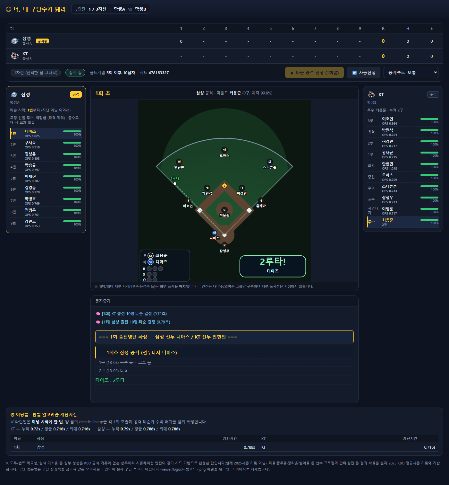

# 너, 내 구단주가 돼라




## 공식 홈페이지
[홈페이지](https://my-baseball.kkh3233.chatgpt.site/)

## 게임 소개

**매 이닝 출전선수를 고르는 알고리즘으로 겨루는 KBO 야구 시뮬레이션 과제입니다.**
학생은 Python 함수 `decide_lineup()`을 구현하고, Tabu Search·GA·PSO 등 메타휴리스틱으로
선수 선택과 타순을 탐색합니다. 승패는 "누가 야구를 더 잘 아는가"가 아니라 "제한된 시간·정보
안에서 누가 더 나은 탐색 알고리즘을 짰는가"로 갈리도록 설계했습니다 — 매 이닝 상대가 누구를
올릴지 확정되지 않은 상태에서 명단을 정해야 하고(상대 투수 전원의 기록·맞대결은 볼 수 있습니다),
체력은 경기 안에서 회복되지 않으며, 함수 호출당 제한시간이 있습니다. 현재 동봉된 2025 시즌
CSV에는 10개 구단, 타자 294명과 투수 281명 (총 575명)이 들어 있습니다.

## 한눈에 보기: 내가 해야 할 일

> **Python 파일 하나에 `decide_lineup()` 함수 하나를 완성해서 제출하면 됩니다.**

- 이 함수는 경기 중 **이닝마다 한 번** 호출됩니다.
- 호출될 때마다 우리 팀 선수 중 **수비 10명**(내야 4 → 외야 3 → 포수 → DH → 투수)과
  그중 투수를 뺀 **타순 9명**을 골라 `{"defense": [...], "offense": [...]}`로 돌려주면 됩니다.
- 명단은 선수 이름이 아니라 **`pCode` 정수**로 적습니다.
- 어떤 선수를 고르고 어떤 순서로 세울지를 **Tabu Search·GA·PSO 같은 탐색 알고리즘**으로 찾는 것이 과제의 핵심입니다.
- 상대 학생의 함수와 **3연전**(3경기)을 치러 승점(승 1, 무 0.5, 패 0)으로 승자를 가립니다.

처음이라면 아래 **STEP 1부터 순서대로** 따라 하세요. 각 단계 끝의 링크에 더 자세한 설명이 있습니다.

## 단계별 따라 하기

| 단계 | 할 일 | 끝났다는 신호 |
|---|---|---|
| [STEP 1](#step-1-설치하기-처음-한-번만) | 프로그램 설치 | `python -m kbo_sim.cli --help`가 옵션 설명을 출력 |
| [STEP 2](#step-2-예제-경기-한-번-구경하기) | 예제 파일로 경기 구경 | 브라우저에서 3경기가 끝까지 진행됨 |
| [STEP 3](#step-3-규칙-핵심만-익히기) | 규칙 핵심 익히기 | 반환 형식과 체력 규칙을 설명할 수 있음 |
| [STEP 4](#step-4-내-알고리즘-파일-만들기) | 템플릿을 복사해 내 파일 만들기 | `my_algo.py`가 생김 |
| [STEP 5](#step-5-decide_lineup-구현하기) | `decide_lineup()` 구현 | 업로드 검사에서 오류 없음 |
| [STEP 6](#step-6-여러-번-돌려서-평가하기) | 여러 번 반복 실행해 평가 | 승률 신뢰구간 하한이 50%를 넘음 |
| [STEP 7](#step-7-제출-전-체크리스트) | 체크리스트 확인 후 제출 | 모든 항목 체크 |

---

### STEP 1. 설치하기 (처음 한 번만)

1. **conda 설치**: [Miniconda](https://www.anaconda.com/download/success)(권장, 페이지 아래쪽 *Miniconda Installers*)
   또는 [Anaconda](https://www.anaconda.com/download)를 설치합니다. 선택 항목은 모두 기본값으로 둡니다.
2. **터미널 열기**: Windows는 시작 메뉴에서 `Anaconda Prompt`, macOS/Linux는 터미널을 엽니다.
3. **프로젝트 내려받기**: [릴리즈 페이지](https://github.com/Kahkim/my_baseball/releases)에서 최신 버전의
   **Source code (zip)**을 받아 압축을 풀고, 터미널에서 그 폴더로 이동합니다.
   `README.md`와 `requirements.txt`가 보이는 폴더가 **프로젝트 최상위 폴더**이며, 앞으로 모든 명령은 여기서 실행합니다.

   ```shell
   cd Desktop\my_baseball-1.0
   ```
   (폴더 이름·위치는 실제에 맞게 바꾸세요.)
4. **환경 만들기 → 활성화 → 패키지 설치 → 확인**을 차례로 실행합니다.

   ```shell
   conda create -n my_baseball python=3.12 pip -y
   conda activate my_baseball
   python -m pip install -r requirements.txt
   python -m kbo_sim.cli --help
   ```

- 프롬프트 앞에 `(my_baseball)`이 보이면 활성화된 것입니다. **터미널을 새로 열 때마다 `conda activate my_baseball`을 다시 실행**하세요.
- `No module named kbo_sim` 오류 → 프로젝트 최상위 폴더에 있는지 확인하세요.

📖 자세히: [프로그램 매뉴얼 1절 설치](docs/프로그램_매뉴얼.md#1-설치)

### STEP 2. 예제 경기 한 번 구경하기

코드를 짜기 전에 프로그램이 어떻게 돌아가는지 먼저 눈으로 봅니다.

1. 서버를 켭니다. 브라우저가 자동으로 열리며, 안 열리면 `http://127.0.0.1:8000`에 직접 접속합니다.

   ```shell
   python -m kbo_sim.server
   ```
2. 화면에서 학생 A/B의 **이름**을 적고, **구단을 서로 다르게** 고릅니다(예: A `삼성`, B `KT`).
3. 알고리즘 파일을 올립니다.
   - A: [examples/student_algorithm_template.py](examples/student_algorithm_template.py) (학생용 템플릿)
   - B: [examples/strategy_naive_best.py](examples/strategy_naive_best.py) (체력을 무시하는 대조군)
4. 자동 검사 결과를 확인합니다. **오류**가 있으면 시작할 수 없고, **경고**는 시작을 막지 않습니다.
5. **[경기 준비 완료 → 3연전 시작]** → **[다음 라인업 선발] → [다음 공격 진행(초)] → [다음 공격 진행(말)]**을
   반복합니다. 번거로우면 **자동진행**을 켭니다. 한 경기가 끝나면 **[다음 경기 시작]**으로 3경기까지 진행합니다.
6. 다 봤으면 터미널에서 `Ctrl+C`로 서버를 끕니다.

- 포트가 이미 사용 중이라는 오류 → `python -m kbo_sim.server --port 8001`
- 경기 결과는 `output/game1.json`~`game3.json`에 저장되며 [리플레이 뷰어](viewer/broadcast_viewer.html)로 다시 볼 수 있습니다.

📖 자세히: [프로그램 매뉴얼 2절 라이브 서버](docs/프로그램_매뉴얼.md#2-라이브-서버-실행하기)

### STEP 3. 규칙 핵심만 익히기

알고리즘을 짜기 전에 꼭 알아야 할 규칙입니다.

| 규칙 | 내용 |
|---|---|
| 호출 시점 | 이닝 시작에 팀당 1번. 초·말 공수교대 때는 다시 부르지 않음 |
| 상대 투수 | **이번 이닝에 누가 나올지 모름.** 대신 상대 투수 전원의 기록·체력과 맞대결 기록은 볼 수 있음 |
| `defense` | 10명, 순서 고정: 내야 4 → 외야 3 → 포수 → DH → 투수(마지막만 실제 투수) |
| `offense` | `defense` 앞 9명과 **똑같은 9명**을 타순대로. 투수는 타격하지 않음 |
| 포지션 불일치 | 허용되지만 그 선수가 타구를 처리할 때 실책 확률 1.5배(DH는 예외) |
| 타순 이어짐 | 매 이닝 1번부터 치는 게 아님. `context["batting_order_start_index"]`부터 시작 |
| 체력 | 경기 중 **회복되지 않음**(벤치에 있어도). 새 경기는 초기화된 상태로 시작 |
| 구단 교대 | 3연전의 경기마다 맡는 구단이 바뀜 → 선수 번호를 코드에 고정하지 말 것 |
| 실패 처리 | 시간 초과(기본 10초)·예외·무효 명단이면 직전 이닝 명단(없으면 기본 명단)으로 대체 |
| 승점 | 경기당 승 1, 무 0.5, 패 0. 3경기 합계가 높은 쪽이 승자 |

📖 자세히: [게임 규칙 매뉴얼](docs/게임_규칙_및_운영_매뉴얼.md)

### STEP 4. 내 알고리즘 파일 만들기

템플릿을 프로젝트 최상위 폴더에 `my_algo.py`로 복사합니다.

```shell
copy examples\student_algorithm_template.py my_algo.py
```

macOS / Linux:

```shell
cp examples/student_algorithm_template.py my_algo.py
```

템플릿은 **그대로도 실행되는** 단순한 그리디 전략입니다. 먼저 수정 없이 STEP 2(라이브) 또는
STEP 6(반복 실행)으로 돌아가는지 확인한 뒤 고치기 시작하세요.

📖 자세히: [프로그램 매뉴얼 3절 2단계](docs/프로그램_매뉴얼.md#2단계-내-알고리즘-파일-만들기)

### STEP 5. `decide_lineup()` 구현하기

```python
def decide_lineup(my_team, opponent_team, matchups, context, rng):
    ...
    return {"defense": [10명의 pCode], "offense": [9명의 pCode]}
```

**함수 이름과 다섯 인자의 이름·순서는 절대 바꾸지 마세요.** 파일 최상위에 정의해야 하며, 보조 함수는 같은 파일에 추가해도 됩니다.

| 인자 | 들어오는 것 |
|---|---|
| `my_team` | 우리 구단 전체 선수(타자+투수)의 기록과 현재 체력 (`role`로 타자/투수 구분) |
| `opponent_team` | 상대 구단 전체 선수의 기록과 체력 |
| `matchups` | 양 팀 투수 전원 × 상대 타자 전원의 맞대결 기록 (기록이 있는 조합만 행이 있음) |
| `context` | 이닝·점수·타순 시작 위치·이전 명단 등 |
| `rng` | 이번 호출 전용 난수 생성기 — **난수는 이것만 사용** |

권장 개발 순서:

1. 어느 구단을 맡아도 **규칙에 맞는 명단**을 돌려주게 만든다.
2. 체력과 기록으로 선수를 평가하는 함수(목적함수)를 만든다.
3. 해(解)를 어떻게 표현할지 정한다. 예: 수비는 선수·포지션 배정, 공격은 9명의 순열.
4. 탐색(Tabu Search·GA·PSO 등) 중에도 중복 선수·투수 자리 규칙을 지키게 한다.
5. 실행시간을 재면서 반복 횟수를 조정한다(제한 10초에는 프로세스 시작·import 시간도 포함).
6. 같은 조건에서 baseline과 비교하고, 여러 시드·구단으로 다시 평가한다(STEP 6).

참고할 예제:

| 파일 | 살펴볼 점 |
|---|---|
| [학생용 템플릿](examples/student_algorithm_template.py) | 기록·체력·표본 크기를 반영하는 그리디 출발점 |
| [Tabu Search 예제](examples/example_tabu_lineup.py) | 수비 명단의 교환·교체 이웃 탐색 |
| [기록 위주 전략](examples/strategy_naive_best.py) | 일부러 나쁘게 만든 대조군 — 체력을 무시하면 왜 무너지는지 보여줌 |

📖 자세히: [프로그램 매뉴얼 5~13절](docs/프로그램_매뉴얼.md#5-제출할-파일과-함수) (입력 컬럼 설명, 최소 동작 예제, TS 구현 전략)

### STEP 6. 여러 번 돌려서 평가하기

야구는 운의 영향이 커서 3경기만으로는 실력을 판단하기 어렵습니다. CLI로 **3연전을 여러 번 반복**해 봅니다.

```shell
python -m kbo_sim.cli --a-name 나 --a-team 삼성 --a-algo my_algo.py --b-name 상대 --b-team KT --b-algo examples/strategy_naive_best.py --seed 12345 --repeat 20 --out output/my_test_repeat
```

- 처음에는 `--repeat 5` 정도로 짧게 돌려 실행시간부터 확인하세요.
- 끝나면 종합 결과가 출력됩니다. **경기 단위 승률의 95% 신뢰구간 하한이 50%를 넘으면** 우연이 아니라 실제로 더 잘하는 것입니다.
  구간이 50%를 포함하면 `--repeat`를 늘려 다시 확인합니다.
- 실행 중 출력되는 `알고리즘 timeout` 메시지가 많다면 승률보다 **실행시간부터** 줄이세요.
- 같은 `--seed`를 쓰면 수정 전후를 같은 조건에서 비교할 수 있습니다. 실험마다 `--out` 폴더를 다르게 지정하세요(같은 폴더는 덮어씀).
- 조건을 바꿔서도 확인합니다: 구단(`--a-team LG --b-team 두산`), 상대(`--b-algo examples/example_tabu_lineup.py`), 시드.

사용 가능한 구단 이름: `삼성`, `KT`, `LG`, `KIA`, `두산`, `NC`, `롯데`, `SSG`, `한화`, `키움`

📖 자세히: [프로그램 매뉴얼 3절 반복 실행](docs/프로그램_매뉴얼.md#3-여러-번-반복해-종합-결과-보기)

### STEP 7. 제출 전 체크리스트

- [ ] 최상위 함수 `decide_lineup`의 이름·인자 이름·순서를 지켰다.
- [ ] 공격은 수비 앞 9명과 같은 선수이고, 수비 10명 중 마지막은 투수다. 정수 pCode이며 중복이 없다.
- [ ] 구단이 바뀌어도 `my_team`에서 명단을 만든다(선수 번호를 코드에 고정하지 않았다).
- [ ] 타순 시작 인덱스, 이전 명단 `None`, 맞대결 행이 없는 투수–타자 쌍(및 빈 표)을 처리한다.
- [ ] 난수는 전달받은 `rng`만 사용한다.
- [ ] 체력 0과 기록 0을 결측값으로 바꾸지 않는다.
- [ ] `input()`, 파일·네트워크 접근, 외부 명령, 추가 패키지(pandas·numpy 외)를 쓰지 않았다.
- [ ] 시간 제한에 여유가 있고, 최종 파일을 라이브 서버에 다시 올려 검사를 통과했다.

제출 파일 이름은 `학번_이름.py`처럼 저장하고(UTF-8), 제출 방법은 수업 안내를 따르세요.

📖 자세히: [프로그램 매뉴얼 11~12절](docs/프로그램_매뉴얼.md#11-제출-전-검사와-경기-중-실패-처리)

## 자주 막히는 곳

| 증상 | 해결 |
|---|---|
| `conda`를 찾을 수 없음 (Windows) | 일반 명령 프롬프트 대신 `Anaconda Prompt`를 사용 |
| `No module named kbo_sim` | 프로젝트 최상위 폴더(`README.md`가 있는 곳)로 이동 후 실행 |
| `No module named pandas` 등 | `conda activate my_baseball`을 했는지 확인 |
| 파일을 고쳤는데 화면에 반영이 안 됨 | 업로드는 복사본으로 저장되므로 **다시 업로드**해야 함 |
| 포트가 이미 사용 중 | `python -m kbo_sim.server --port 8001` |
| 이닝마다 명단이 이상하게 반복됨 | 시간 초과·오류로 직전 명단이 재사용된 것. 콘솔의 `timeout`/오류 메시지 확인 |
| 전역 변수 값이 다음 이닝에 사라짐 | 매 호출이 새 프로세스에서 실행되므로 정상. 필요한 정보는 `context`에서 읽기 |

## 문서 안내

| 문서 | 다루는 내용 |
|---|---|
| **이 README** | 소개, 단계별 따라 하기, 저장소 구조 |
| [프로그램 매뉴얼](docs/프로그램_매뉴얼.md) | **설치·실행 방법**(라이브 서버·CLI·`--repeat`), 결과 파일, 제출 함수의 입력·출력·개발 순서 |
| [게임 규칙 매뉴얼](docs/게임_규칙_및_운영_매뉴얼.md) | **경기 규칙만**: 이닝 진행, 명단·타순 규칙, 체력, 종료 규칙, 3연전 승점 |
| [학생용 템플릿](examples/student_algorithm_template.py) | 제출 파일을 만들 때 복사해서 시작하는 틀 |
| [데이터 수집 매뉴얼](docs/데이터_수집_매뉴얼.md) | KBO 공식 기록실에서 최신 시즌 데이터를 다시 받는 방법 |

## 폴더 안내

| 경로 | 내용 |
|---|---|
| [docs/](docs/) | 학생 배포용 게임 규칙·프로그램 매뉴얼 |
| [examples/](examples/) | 제출 템플릿, 비교용 예제 2개(나쁜 전략 대조군 · Tabu Search) |
| [kbo_sim/](kbo_sim/) | 경기 엔진, 학생 함수 실행·검사, 서버·CLI |
| [kbo_sim/data_snapshot/](kbo_sim/data_snapshot/) | `teams`/`batters`/`pitchers`/`matchup` CSV (날짜 붙은 파일이 있으면 최신 것을 사용) |
| [viewer/](viewer/) | 라이브 중계 화면과 리플레이 뷰어 |
| [viewer/logos/](viewer/logos/README.md) | 구단 로고 설정 안내 |
| [tools/](tools/) | 회귀 검사, 전체 검사, 밸런스·전략 비교 도구 |
| [uploads/](uploads/) | 라이브에서 올린 제출 파일. 업로드마다 별도 하위 폴더에 저장 |
| [output/](output/) | 기본 경기 결과 저장 폴더 |

실행할 때는 `data_snapshot/`에 동봉된 CSV를 읽습니다. `python tools/collect_kbo_data.py`를
실행하면 KBO 사이트에서 오늘 날짜 기준 최신 데이터를 새로 받을 수 있습니다 — 자세한 사용법은
[데이터 수집 매뉴얼](docs/데이터_수집_매뉴얼.md)을 참고하세요. 데이터 출처와 확률 계산
범위에 대한 설명은
[게임 규칙 매뉴얼의 "데이터와 시뮬레이션의 범위"](docs/게임_규칙_및_운영_매뉴얼.md#7-데이터와-시뮬레이션의-범위)를 참고하세요.

## 엔진 자체 점검 (학생들은 몰라도 됨)

**이 절의 스크립트는 학생이 제출한 `decide_lineup`을 검사하는 도구가 아닙니다.**
내 제출 코드를 확인하려면 [프로그램 매뉴얼](docs/프로그램_매뉴얼.md)의 라이브 서버·CLI 사용법을
따르세요. 아래 도구들은 **엔진(`kbo_sim`) 자체**가 의도대로 동작하는지 확인하는, 강의를
운영·개발하는 쪽에서 쓰는 스크립트입니다. 엔진 코드나 상수를 고쳤을 때 돌려서 깨진 곳이 없는지 확인합니다.

| 명령 | 확인 대상 |
|---|---|
| `python tools/test_regressions.py` | 이닝 내 선발 고정, 업로드 처리, 끝내기 규칙, 동명이인 집계 등 과거에 깨졌던 부분 (수 초 내 완료) |
| `python tools/verify.py` | 데이터 무결성·타석 처리·학생코드 격리·3연전 대진표·JSON 직렬화·득점 환경까지 엔진 전체 자체 점검 (7개 항목, 파일 상단 docstring 참고) |
| `python tools/calibrate.py` | 체력 반영 전/후 득점·타석 수가 KBO 현실 범위(9이닝 4~5.5점)에 들어오는지, 학생 알고리즘 없이 엔진 확률 모델만으로 측정 |
| `python tools/tournament.py [시드 수] [프로세스 수]` | `examples/`의 예제 전략들을 라운드로빈으로 맞붙여 "더 좋은 전략이 실제로 더 자주 이기는가"를 신뢰구간과 함께 확인 |

네 도구 모두 결과는 실행한 조건에서의 측정값이며 특정 전략의 승률이나 실행시간을 보장하지 않습니다.

`tools/tournament.py`가 비교하는 참가자는 커맨드라인 인자가 아니라 파일 상단의
`ENTRIES` 리스트(`(이름, 파일경로)` 튜플)에 정해져 있습니다. 내가 만든 파일을 이 비교에
끼워 넣고 싶다면 `tools/tournament.py`를 열어 `ENTRIES`에 `("내알고리즘", "my_algo.py")` 같은
튜플을 추가하세요. 학생에게 배포하는 절차가 아니라 예제/엔진을 관리하는 쪽에서 쓰는 방식입니다.

새로 생성하는 CLI 요약 JSON의 `score`와 `winner`는 참가자 ID `A`/`B`를 사용합니다.
`students`는 ID와 표시 이름의 매핑이고, 경기별 `home_id`/`away_id`는 팀 교대 후에도 같은 참가자를 가리킵니다.
라이브 API의 `points`도 ID를 키로 사용합니다. 기존에 저장된 JSON은 자동 변환하지 않습니다.


## 고쳐야 할것

